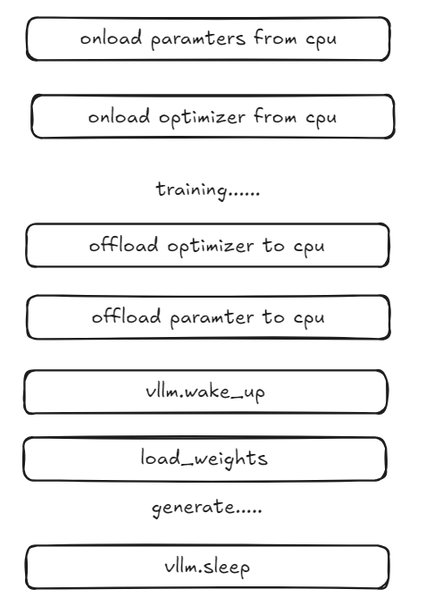
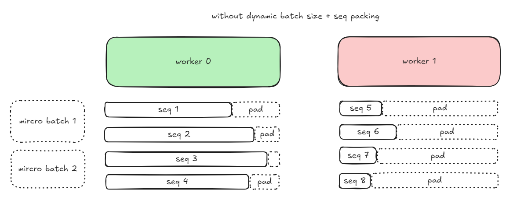
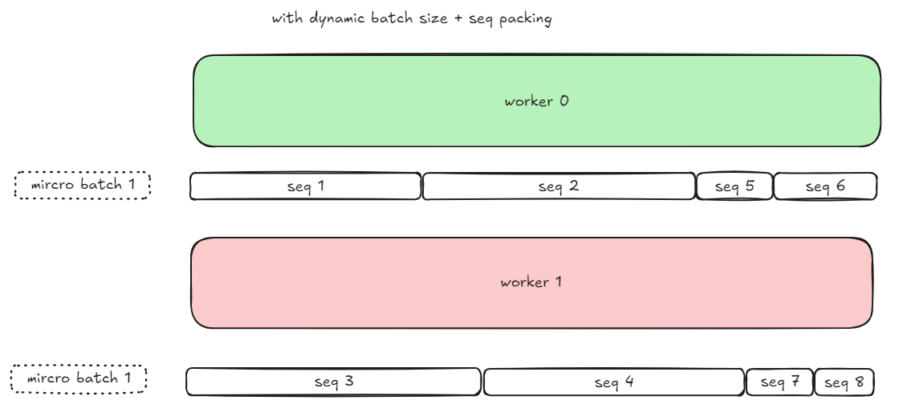

verl的整体设计有一些最重要的设计理念和概念，简单学习了一下，总结如下

**1.整体框架** 包括控制流和计算流以及编程模型。

**2.核心性能feature** 包括remove_padding/seq packing 以及 dyanmic batch size

### Single Controller + Multi Worker

通常分布式训练框架都采用 Multi Controller 的方式，例如 Megatron, Deepspeed 等训练框架，具体来说是 SPMD （Single Program Multi Data）的，这种方式相当于一个没有领导的团队，每个人拿到一份任务清单，每个人根据自己的编号（rank）来做自己应该做的事，这样做有很多优势，不存在主节点会使得整体系统的负载是非常均衡的。

但是由于 RL 的复杂数据流，multi controller 的方式对用户来说很难修改算法。为了提高易用性，verl 采用 **Single Controller + Multi Worker** 的架构，由一个主进程 **Driver**管理和调度所有的 **Worker** 子进程，所有的worker只负责执行，而Driver负责发射指令和调度。这就相当于说这个团队是有一个leader的，他负责调度和控制每个worker去做什么，而worker只负责执行，不用知道别的worker在做什么，driver负责必要的数据同步和通信。

但是每个指令都要给所有的worker发一遍，这样写成循环的形式就很不优雅，于是有个WorkerGroup的概念，这就相当于说leader为了不每次有事情需要找所有人说一遍，直接拉一个群，在群里做通知就行了，于是就有了集合程序调用的概念（Colloctive Remote Process Call），那这个怎么实现呢，就是一组Worker会绑定为一个**WorkerGroup**，分配给一个资源池**Resource Pool**, 主进程通过控制worker group而不是每一个单独的worker来进行集合式的远程函数调用 **（Colloctive Remote Process Call）**


verl 中的worker可以动态切换具体的角色，每一个worker在不同的训练阶段会成为不同的角色 Role（例如从actor切换为rollout再切换到ref），为了适配不同角色和方法所需的数据划分细节（例如在dp维度切分数据、在3d维度切分数据等），VeRL设计了一套数据传输协议（Data Transfer Protocol）。

定义了数据的划分（Split），分发（Dispatch）和收集（Collect）方式。

一个例子：

DP_COMPUTE_PROTO 用来在不同的DP节点中分发数据并收集每个dp_rank计算所得的结果

```
# in worker process
@register(Dispatch.DP_COMPUTE_PROTO)
def generate_sequences(data):
    ...

# in driver process
worker_group.generate_sequences(data)

```

在主进程中调用generate_sequences函数实际上执行的是下面四个步骤

```
split(data) # 将总的数据划分为dp size个
dispatch(data) # 将每个dp的数据发送给对应的rank，使用ray的序列化方式发送
execute(dp_data) # 每个rank执行对应的函数
collect(result) # 再从每个rank上收集对应的结果
```

这种对通信和数据的抽象，极大地减少了算法开发者的开发成本，在算法开发过程中不需要关注通信以及数据流，拿到的是全局的data，得到的也是全局的result。类似对数据做筛选这种逻辑会很容易地在主进程中实现并控制整体的训练流程。

这种single controller multi worker的思想，在推理引擎中是非常常见的，例如起一个 vllm 在线服务，这个服务通常只有一个入口，但需要调度很多个gpu资源，vllm 中如果一个模型需要切分放在不同的卡上，例如 (tp,pp) 就是通过这种方式实现的，而不会有多个 vllm 实例，下次将 vllm 的时候会仔细讲解vllm的架构和设计。但是这个在训练引擎中比较陌生，在早期的 参数服务器架构 中会有一些类似的思想，但是现代主流训练框架，例如 torch，megatron，deepspeed都不是这种架构，而是上文提到的 SPMD 架构。

### Hybrid Engine

首先回顾一下在强化学习中，有着大量的数据依赖，即inference阶段必须等待generate阶段完成，training阶段又必须等待inference阶段完成，于是这样需要训练引擎等待推理引擎完成推理，然后做完inference阶段计算log_prob，values等所需的值，才能训练，如果训练引擎和推理引擎是放在不同的GPU资源池上，那么在推理阶段，训练引擎就需要傻傻地等着推理引擎完成推理，这个bubble时间在推理较长的场景下是很难接受的。像下面这张图这样（这张图是英伟达的小伙伴画的，这里借用一下）。


于是verl引入了**hybrid engine**的概念

理解hybrid engine主要就是要理解，训练引擎和推理引擎是跑在同一个进程里的，只不过在不同的时间具有不同的角色。

在verl中，每一个 Worker 会拥有不同的角色 Role.Actor, Role.Rollout，

在 generate 阶段，driver进程会给worker发送generate sequence指令，于是worker会把推理引擎加载到显存上，执行推理。

在 inference 阶段，driver进程会给worker发送compute log prob指令，于是worker会把训练引擎加载到显存上，计算对应的adv log_prob等值。

在 training 阶段，driver进程会给worker发送update指令，于是worker会使用训练引擎，进行前向和反向传播。

具体实现依赖于训练和推理框架三个个重要的功能：

1.训练引擎的加载和卸载（在verl中，主要通过将fsdp的optimizer和params grads等 offload 到 cpu 实现）

2.推理引擎释放显存 （vllm 0.7.0 通过sleep mode将kv cache释放）

3.参数同步。（每个step需要将训练引擎的参数同步给推理引擎）

在训练过程中，每个worker 进程会执行以下流程：



hybrid engine保证了对gpu资源的高利用率。且在大部分场景下性能几乎都是最优的。

至此，我们就理解了verl整体的设计思路以及他的优势，控制流和计算流分离，算法开发者只需要关心主流程，剩下所有的工程细节都封装在了worker中。

下面我们看一下在性能优化方面所做的重要feature

接下来夹带一些私货，简单宣传下我们基于verl_pipeline项目，做的一个async training方案。

### remove padding/seq packing + dynamic batch

由于生成阶段，生成的长度不一样且不可预知，在训练阶段如果不做任何处理，很容易有一些卡上很多长序列，一些卡上很多短序列的情况, 这样会造成两个问题，一个是需要padding到指定长度，造成很多不必要的计算，其次，不同机器之间有效token数量不一样，负载严重不均衡

verl中使用了两个feature来解决这个问题，第一个是remove_paddding/seq packing 会把padding去掉拼成一条 增加了有效token占比

其次，使用dynamic batch size，动态调整micro batch的数量

下面用一个例子讲解一下 假设一个global batch有8条数据 有两个worker  每个micro batch有2条数据

worker 0拿到的数据都比较长 worker1拿到的数据都比较短，会有很多padding



通过remove padding可以把同一个micro batch中的数据padding去掉并拼成一整条丢给worker


但是这样仍然有严重的负载不均衡问题，dynamic batch可以通过对seq进行分桶，先平衡各个rank之间的token总数，动态调整batch size（不影响梯度累加），再进行拼接操作，大幅提高性能。


